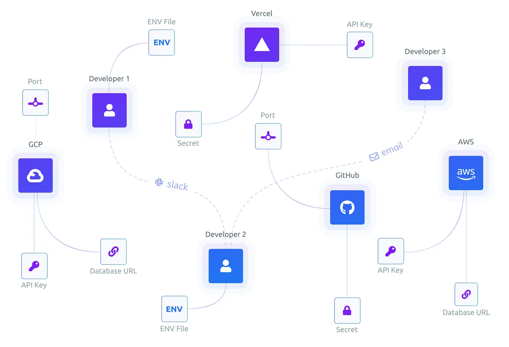

前几天，在推特上火炬随手发了一个在线加密的网站，后来我查看了它的服务，发现它是一个非常有意思的在线服务。简单来说，就是通过一个在线服务可以管理你部署应用时的环境变量（env）。这里简单记录一下，方便以后快速使用。



# 安装

使用 Doppler 需要一个可以在本地执行的命令行工具。安装可以参考 [官方文档](https://docs.doppler.com/docs/enclave-installation)。

在 macOS 下使用 brew：

```
brew install dopplerhq/cli/doppler
```

在 Debian 类 Linux 里使用 apt 安装：

```
sudo apt-get update && sudo apt-get install -y apt-transport-https ca-certificates curl gnupg
curl -sLf --retry 3 --tlsv1.2 --proto "=https" 'https://packages.doppler.com/public/cli/gpg.DE2A7741A397C129.key' | sudo apt-key add -
sudo apt-get update && sudo apt-get install doppler
```

在 CentOS 类 Linux 使用 yum 安装：

```
sudo rpm --import 'https://packages.doppler.com/public/cli/gpg.DE2A7741A397C129.key'
sudo curl -sLf --retry 3 --tlsv1.2 --proto "=https" 'https://packages.doppler.com/public/cli/config.rpm.txt' > /etc/yum.repos.d/doppler-cli.repo
sudo yum update && sudo yum install doppler
```

如果需要升级：

```
doppler update
```

当然，brew/apt/yum 也会在升级时帮你升级。

# 登录

在你的开发环境里可以考虑登录，在服务器等生产测试环境里这步不需要。登录只需要一次：

```
doppler login
```

会提示你打开浏览器，按提示操作即可。

# 开发环境的使用

在要使用的目录里，执行：

```
doppler setup
```

这里会提示让你选择 project 和环境名称。选择好以后，在这个目录下启动的程序都会使用你在 doppler.com 上设置的项目和环境名的环境变量。设置好以后，可以试试这个命令：

```
doppler run -- env
```

你会在环境变量里看到你在云上设置的所有环境变量。

有关设置 VS Code 的部分，可以参考 [官方文档](https://docs.doppler.com/docs/editors-vs-code)。

设置起来还算简单，但是需要在每个不同的项目里都做设置。另外，在 Python 项目里并不支持直接运行，需要 debug 模式。在对应的环境里还需要多安装一个包：

```
pip install doppler-env
```

# Docker 部署

有关 Docker 使用的官方文档在这里：[官方文档](https://docs.doppler.com/docs/enclave-installation-docker)。

我自己的使用方法是在 Dockerfile 里先加入：

```
RUN (curl -Ls https://cli.doppler.com/install.sh || wget -qO- https://cli.doppler.com/install.sh) | sh
```

然后在 CMD 指令前加入：

```
ENTRYPOINT ["doppler", "run", "--"]
```

本地在使用了 Doppler CLI 的环境里可以这样运行 Docker：

```
docker run --rm -it --init \
  -e "DOPPLER_TOKEN=$(doppler configure get token --plain)" \
  -e "DOPPLER_PROJECT=$(doppler configure get project --plain)" \
  -e "DOPPLER_CONFIG=$(doppler configure get config --plain)" \
  docker-image
```

在测试和生产环境里运行则可以这样：

```
docker run --rm -it --init -e DOPPLER_TOKEN="$DOPPLER_TOKEN" docker-image
```

# 脱离 Doppler

如果都使用官方提供的方案，你就会发现有一个巨大的 Bug：当你的项目万一不想使用 Doppler 时，你就需要把所有的 Docker image 重新 build 一遍。如果你的项目是一个开源的项目，想让更多的人使用，这就相当于把别人也绑上了必须使用 Doppler 的道路，这非常不合理。

周六和小朋友们玩完后，下午查看了一个 Doppler 的 REST 官方 API，总结了一个简单的方法，参考 [官方文档](https://docs.doppler.com/reference)。

简单来讲就是你只要配置一个 DOPPLER_TOKEN 的环境变量，我们就从 Doppler 去取环境变量回来，如果没有这个环境变量，该用什么就用什么，一切恢复原样。我的代码可以参考：[代码链接](https://github.com/HDCodePractice/WangWangBot/blob/main/WangWangBot/config.py)。

好了，把 Doppler 作为一个 Web ENV UI，其它的该做什么做什么吧。
