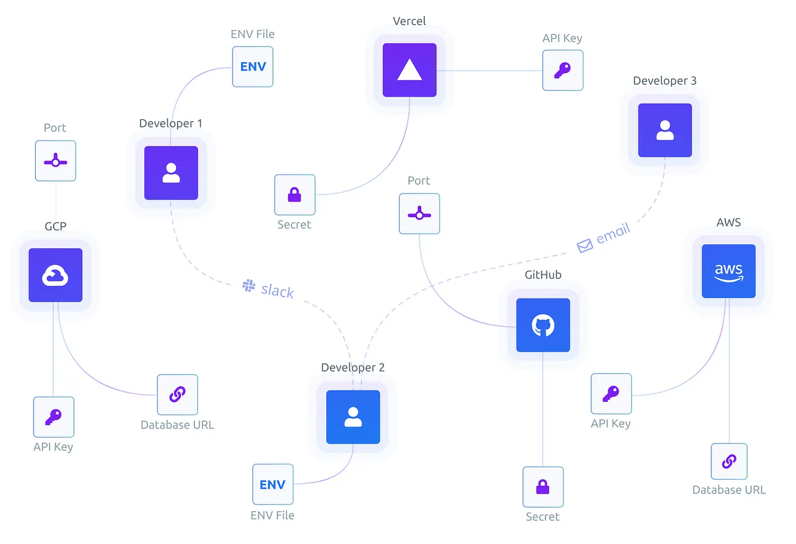

A few days ago, Torch casually shared an online encryption website on Twitter. Later, I checked its service and found it to be a very interesting online service. In simple terms, it allows you to manage the environment variables (env) when deploying your application through an online service. Here is a brief note for quick use in the future.



# Installation

To use Doppler, you need a command-line tool that can be executed locally. You can refer to the [official documentation](https://docs.doppler.com/docs/enclave-installation) for installation.

Use brew on macOS:

```
brew install dopplerhq/cli/doppler
```

Use apt to install on Debian-based Linux:

```
sudo apt-get update && sudo apt-get install -y apt-transport-https ca-certificates curl gnupg
curl -sLf --retry 3 --tlsv1.2 --proto "=https" 'https://packages.doppler.com/public/cli/gpg.DE2A7741A397C129.key' | sudo apt-key add -
sudo apt-get update && sudo apt-get install doppler
```

Use yum to install on CentOS-based Linux:

```
sudo rpm --import 'https://packages.doppler.com/public/cli/gpg.DE2A7741A397C129.key'
sudo curl -sLf --retry 3 --tlsv1.2 --proto "=https" 'https://packages.doppler.com/public/cli/config.rpm.txt' > /etc/yum.repos.d/doppler-cli.repo
sudo yum update && sudo yum install doppler
```

```
sudo rpm --import 'https://packages.doppler.com/public/cli/gpg.DE2A7741A397C129.key'
sudo curl -sLf --retry 3 --tlsv1.2 --proto "=https" 'https://packages.doppler.com/public/cli/config.rpm.txt' > /etc/yum.repos.d/doppler-cli.repo
sudo yum update && sudo yum install doppler
```

If you need to upgrade:

```
doppler update
```

Of course, brew/apt/yum will also help you upgrade during updates.

# Login

In your development environment, you might consider logging in; this step is not necessary in server or production test environments. You only need to log in once:

```
doppler login
```

It will prompt you to open the browser; just follow the instructions.

# Using in Development Environment

In the directory you want to use, execute:

```
doppler setup
```

This will prompt you to choose the project and configuration name. After selection, programs started in this directory will use the environment variables of the project and configuration you set on doppler.com. After setting up, you can try this command:

```
doppler run -- env
```

You will see all the environment variables you set in the cloud in the environment variables.

For setting up VS Code, you can refer to the [official documentation](https://docs.doppler.com/docs/editors-vs-code).

Setting it up is relatively simple, but you need to configure it in every different project. Additionally, in Python projects, direct execution is not supported and requires debug mode. In the corresponding environment, you also need to install an extra package:

```
pip install doppler-env
```

# Docker Deployment

The official documentation for using Docker is here: [Official Documentation](https://docs.doppler.com/docs/enclave-installation-docker).

My own method is to first add in the Dockerfile:

```
RUN (curl -Ls https://cli.doppler.com/install.sh || wget -qO- https://cli.doppler.com/install.sh) | sh
```

Then add before the CMD instruction:

```
ENTRYPOINT ["doppler", "run", "--"]
```

In the local environment where you've used the Doppler CLI, you can run Docker like this:

```
docker run --rm -it --init \
  -e "DOPPLER_TOKEN=$(doppler configure get token --plain)" \
  -e "DOPPLER_PROJECT=$(doppler configure get project --plain)" \
  -e "DOPPLER_CONFIG=$(doppler configure get config --plain)" \
  docker-image
```

In testing and production environments, you can run like this:

```
docker run --rm -it --init -e DOPPLER_TOKEN="$DOPPLER_TOKEN" docker-image
```

# Detaching from Doppler

If you follow the official solution, you will find a huge bug: If your project no longer wants to use Doppler, you need to rebuild all the Docker images. If your project is open source and you want more people to use it, this is equivalent to forcing others to use Doppler, which is very unreasonable.

After playing with friends on Saturday, I checked the official REST API of Doppler in the afternoon and summarized a simple method, referring to the [official documentation](https://docs.doppler.com/reference).

Simply put, as long as you configure an environment variable `DOPPLER_TOKEN`, we can retrieve the environment variables from Doppler. If there is no such environment variable, use whatever is available, and everything returns to normal. My code can be referenced here: [Code Link](https://github.com/HDCodePractice/WangWangBot/blob/main/WangWangBot/config.py).

Well, treat Doppler as a Web ENV UI, and proceed with whatever else needs to be done.
