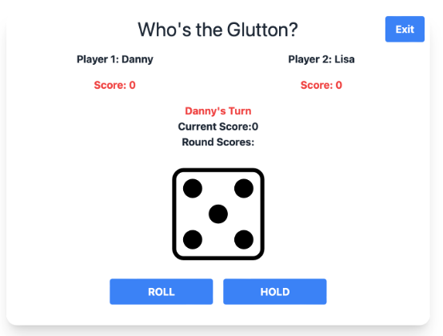

This project is a mini exercise designed for classroom learning. It is an online two-player dice game where players take turns to roll a dice. 

1. Enter the names of the two players and click "Start Game."
2. Click "Roll" to get a random dice roll.
3. If the roll is not 1, you can continue rolling.
4. If the roll is 1, you lose your turn, and it’s the next player’s turn.
5. You can choose to "Hold" to keep your score, and then it’s the next player’s turn.
6. The first player to reach a score of 20 wins.

Enjoy the game and may the best player win!

Technologies and libraries used:
- Python
- Flask
- Server Template
- wtforms
- session

