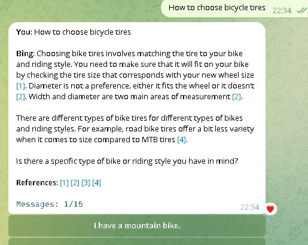
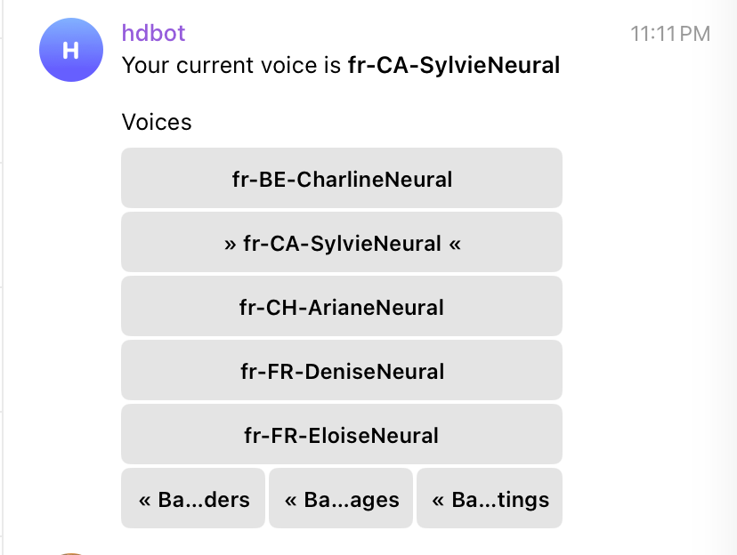

This Telegram bot utilizes the unofficial EdgeGPT API to engage in text and voice conversations with users. The bot can reply to text messages and voice messages, and can also generate text messages based on user input. The bot is deployed in a container and uses SQLite to store user data. The bot is written in Python and uses the Telegram Bot API to communicate with users. The bot is also containerized using Docker. Users can even choose the tone and language of the voice. The funniest part is when you have a person from Northeast China speaking English with a comedic twist, which makes it impossible to stop.

I pioneered the voice ASR and TTS dialogue functions for the project and allowed it to support Docker running.

Features:
- Text-based conversation
- Voice-based conversation
- Customizable voice tone and language
- Docker containerization
- SQLite database for user authentication
- Telegram Bot API for communication
- EdgeGPT API for text generation
- EdgeTTS API for voice generation

Technologies and libraries used:
- Python, Docker, SQLite
- Telegram Bot API, EdgeGPT API, EdgeTTS API

 