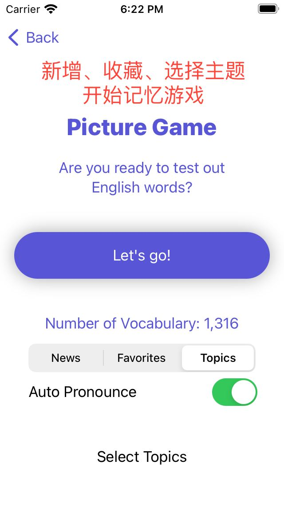
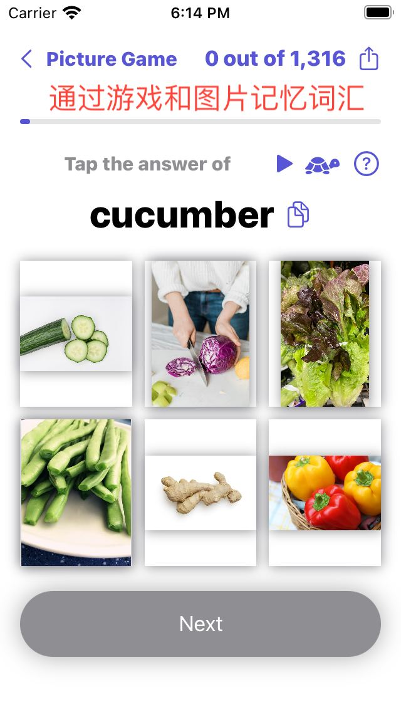
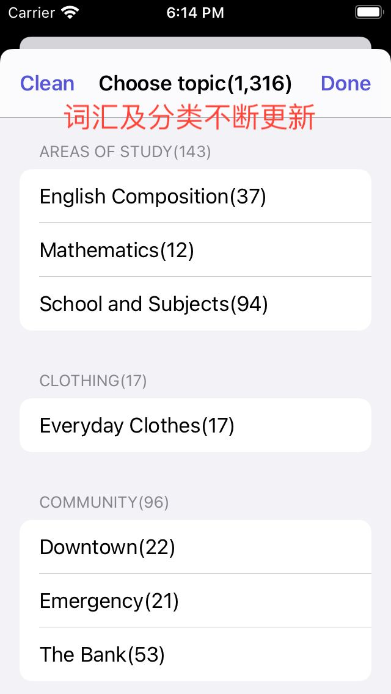

This is an app that runs on iPhone and iPad to help you learn English vocabulary. It has been used and continuously improved over six months by my teachers, classmates, and friends. Its features include:

- Categorized dictionaries and word banks for browsing and searching
- Word pronunciation with both normal and slow speeds
- Each word comes with an image to help you remember
- All data is stored in the cloud and can be updated anytime
- You can test or reinforce your memory with the picture game
- You can test or reinforce your memory with the listen-and-match game

Technologies used: Python, Telegram Bot API, Docker, SQLite






```
