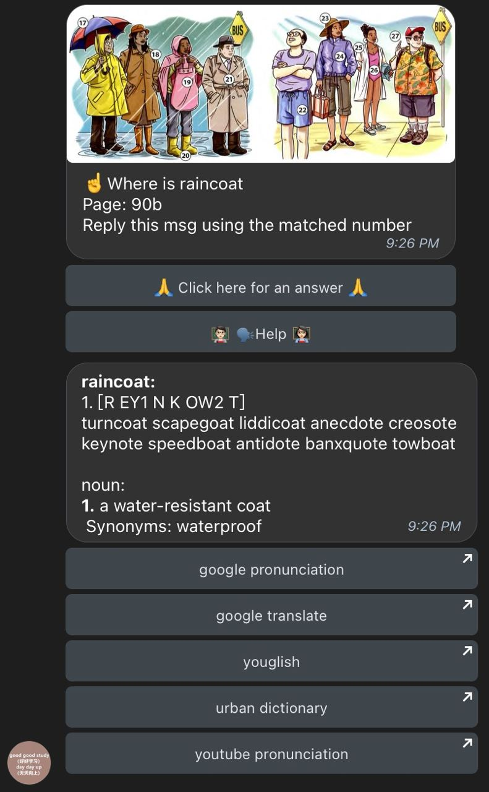

This is a Telegram bot for me and my friends to practice English. It has accompanied me from learning ABCs to being able to speak with people. It uses the phonetic database from [The CMU Pronouncing Dictionary] and the word relationship data from [WordNet](http://wordnet.princeton.edu/). It can help you learn English through a chatbot with the following main features:
* Supports querying irregular past tense, past participle, and plural forms
* Supports word meaning queries and explanations
* Adds example sentences for different word meanings
* Supports querying synonyms and antonyms of words
* Supports querying multiple pronunciations of words
* Supports querying similar sounding words for easier memorization
* Supports listening to pronunciations via Google (standard and slow speed)
* Supports querying word translations via Google Translate
* Supports listening to thousands of videos containing the word via YouGlish
* Supports querying slang explanations via Urban Dictionary
* Supports grammar queries
* Supports word search games in graphics
* Supports spelling games in graphics
* Supports uploading your own graphic dictionary
* Supports words with multiple meanings in one graphic
* Supports a word appearing in multiple graphics

