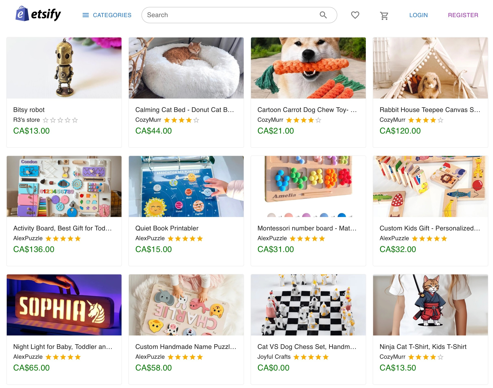

This was a one-and-a-half-week team project completed by three members: [Tamara](https://github.com/tamara-plante), [Iana](https://github.com/iasssy), and me, as part of a course assignment. The goal was to create a simplified version of an online marketplace, similar to Etsy. It supports user registration via username and Google Auth, browsing, a shopping cart, and a checkout process with Stripe for payments. Additionally, users can create and manage their own stores. Due to time constraints, the search functionality and some store item management features were not completed. However, as a one-and-a-half-week team project, it’s a piece of work that I am quite proud of.

I have completed 30%+ of the front-end and back-end work in this project, as well as supporting its CI/CD capabilities and deploying it to the cloud.

Technologies and libraries used:
- Vite, React, zustand, Material UI, Tailwind CSS
- Node.js, Express, Sequelize, Jest, supertest
- MySQL, AWS RDS, AWS S3
- Authentication: JWT, Google Auth

CI/CD:
- GitHub Actions for CI/CD
- Deployed on Cloudflare Pages and Heroku
- Database hosted on AWS RDS
- Images stored on AWS S3
- Stripe for payments
- Google Auth for user authentication
- Jest and supertest for testing
- Backend test coverage: [71.85%](https://app.codecov.io/gh/hdcola/etsifyapi) 

  
