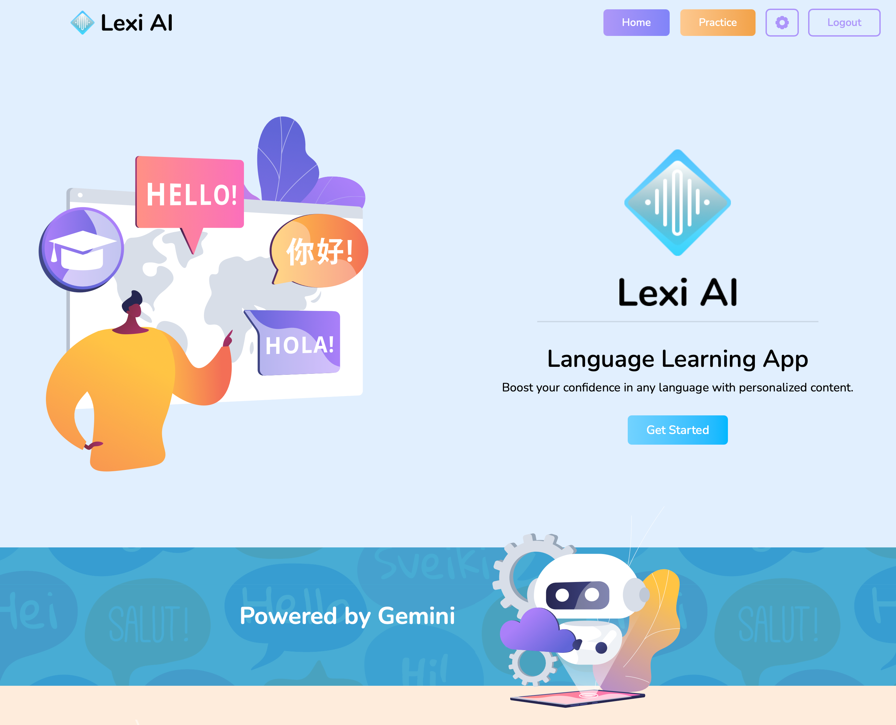
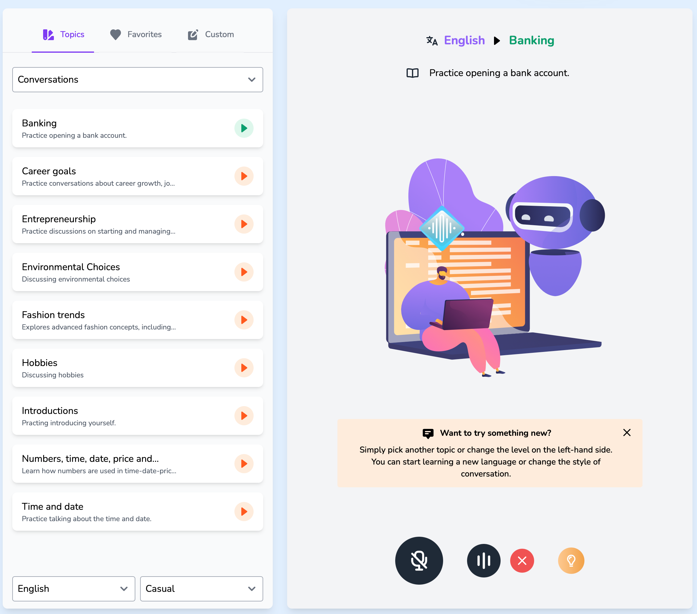
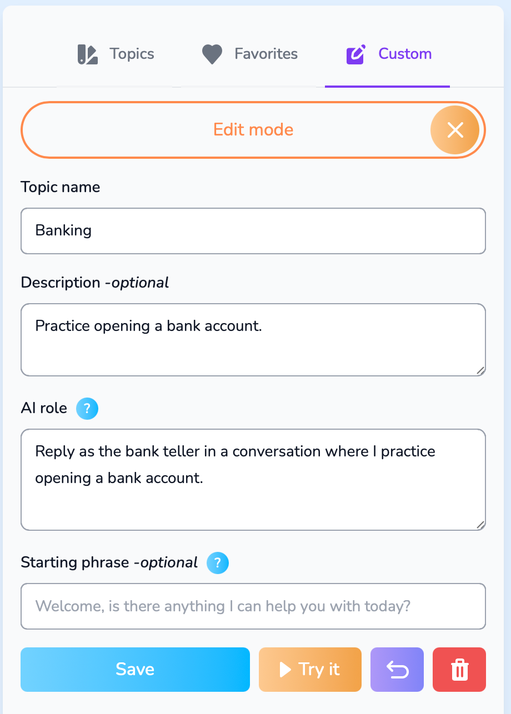

This project was inspired by my own experience learning English. My teammates and I saw the latest real-time multimodal AI technology from Google and OpenAI, and we decided to use it for our project. Lexi AI is an online platform for learning foreign languages. Users can practice listening and speaking, and they can also share their practice content with others. The goal is to let users practice anytime, anywhere, and connect with other language learners. I believe AI technology will make this platform even better and help more people improve their language skills.

Features:
- Responsive design
- Real-time multimodal AI
- Listening and speaking practice
- Practice content sharing
- User profiles

Technologies and libraries used:
- Vue, Tailwind CSS
- MongoDB, Django, Python
- Cloudflare and Heroku for hosting
- GitHub for version control

