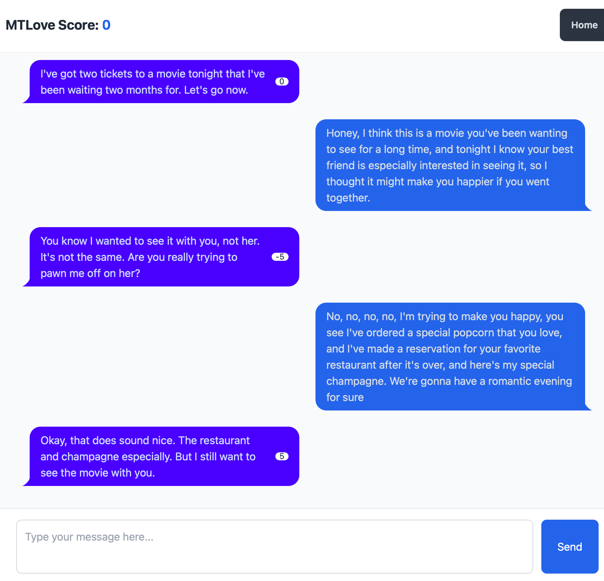
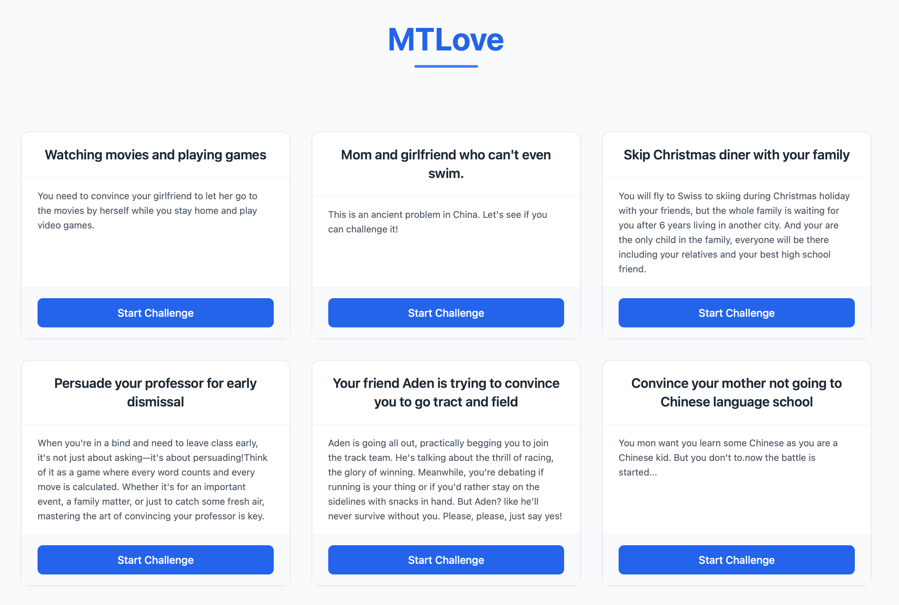
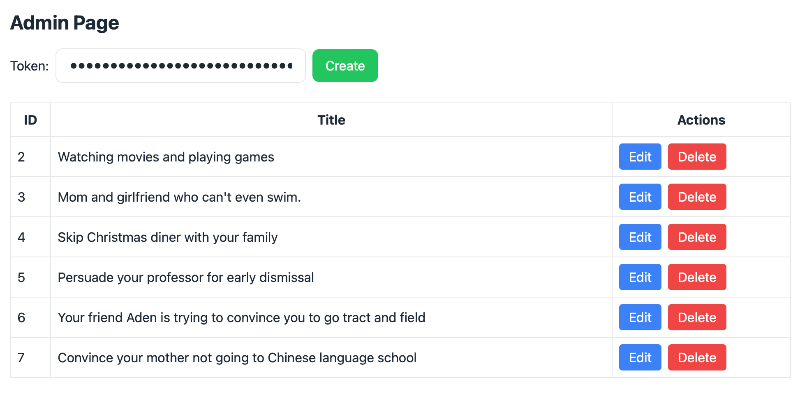

This project uses GenAI technology to help users practice speaking and build more loving emotional connections through a fun game. I really love this project because it helps people practice speaking while also building more loving emotional connections. It supports using different AI backend services and has a backend to help create various challenge scenarios.

Features:
- Responsive design
- GenAI technology
- Chat and game

Technologies and libraries used:
- React, Tailwind CSS
- Cloudflare Pages, Workers and D1 Database
- GitHub for version control

