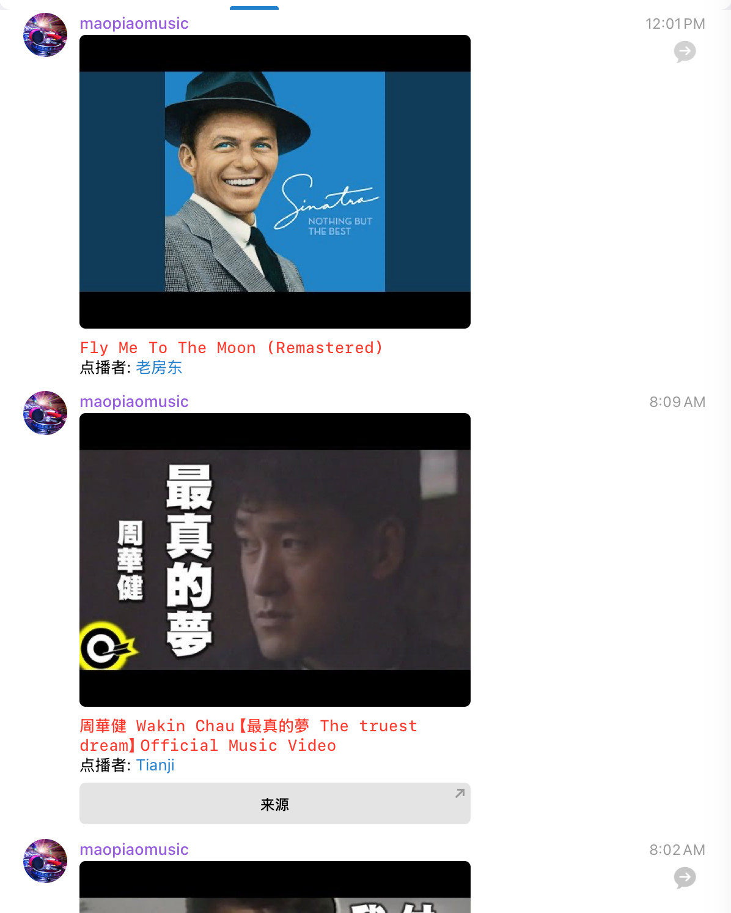
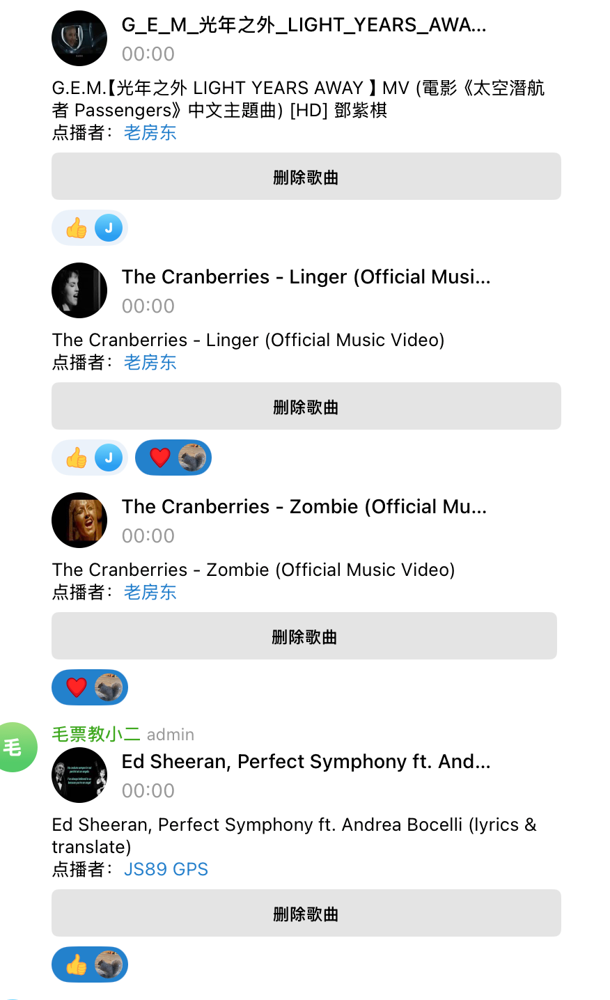
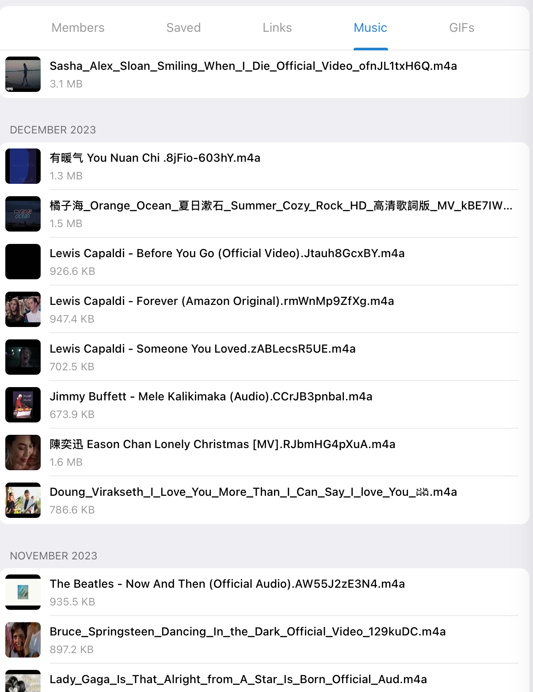

This is a Telegram-based music player Userbot & Bot project. You can add music on demand for a group or channel, and play a live stream when no music is requested. It also includes repeat requests and personalized favorites. It has the following features:

- Playlist, queue
- Supports playing from YouTube live streams
- Supports searching songs from YouTube
- Supports playing from Telegram files
- Starts broadcasting if there are no songs in the playlist
- Automatically downloads the audio of the first two songs in the playlist to ensure smooth playback
- Automatically restarts even if Heroku restarts
- Supports using Bot to favorite songs
- Supports one-click re-request

Technologies and libraries used:
- Python
- Pyrogram
- pytgcalls
- ffmpeg-python
- youtube_dl
- youtube_search
- pytest, pytest-asyncio
- Heroku

