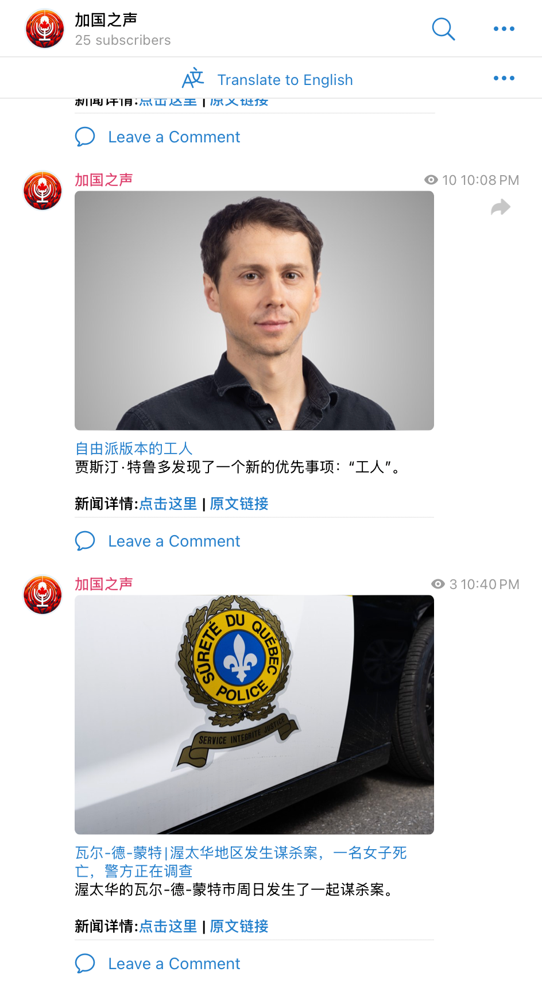
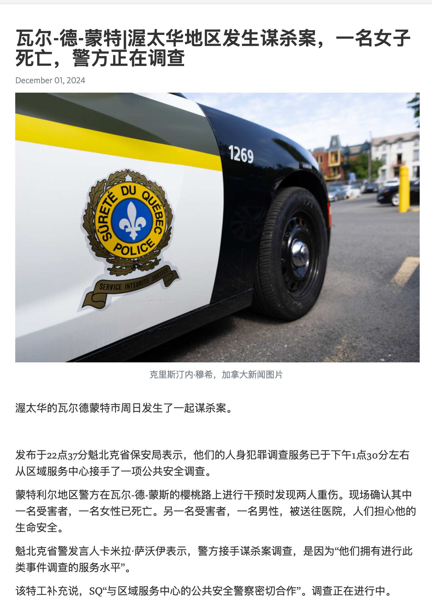

It's a Telegram channel that uses AI to help Chinese people read local Canadian news. The AI is used to translate and organize the news to be rearranged and posted on Telegraph and read via Telegram.

Features:
- Translate Franch news to Chinese
- Organize news to be read in a more structured way
- Use Telegram Bot API to post news on Telegram channel
- Use Telegraph to host the news
- Use OpenAI or Ollama to translate the news

Technologies:
- Python, PDM, pytest
- Telegram Bot API
- OpenAI API
- Ollama local LLM
- Docker & Enroot
- Telegraph
- MongoDB
- Doppler
- requests, BeautifulSoup, lxml, lxml-html-clean,



```